# Create a new application from a template

After you successfully created a new dev space in Business Application Studio, you can now create a SAP UI5 applications. To reduce development time you will be leveraging one of the preexisting templates available.

## Step 1: Create new project

1. In SAP Business Application Studio, open the SAP Fiori dev space you created by clicking the name of the dev space.


2. Open **View > Find Command...** and select **CF: Login to cloud foundry**.


3. The API endpoint should be automatically inserted (https://api.cf.sap.hana.ondemand.com), press *Enter*


4. When prompted for user credentials, please use your SAP **email** and SAP password.


5. Select organization **SA P&T CAN Demo_TAINTERNAL1**.


6. Select space **Dev**.


7. After these set of steps, you should see a connected message at the bottom as seen here:


## Step 2: Create new project

1. Create a new SAP Fiori project from a template.


2. Select the Fiori Project template and click **Next**.


3. For Target Running Environment, select the following, and click **Next**.

Step | Parameter | Value
------------ | ------------- | -------------
A | Select the target running environment | **Cloud Foundry**
B | Select the template you want to use | **SAP Fiori Worklist Application ODataV4**


4. For Project Name, enter **IncidentReport_*IXXXXXX**, and click **Next**.

> Note: Don't forget to replace *IXXXXXX* with you I number.


5. Select **Standalone Approuter** as HTML 5 Applications Runtima.


6. For Basic Attributes select the following, and click **Next**.

> Note: Don't forget to replace *IXXXXXX* with you X number.

Step | Parameter | Value
------------ | ------------- | -------------
A | Enter an HTML5 module name | **IncidentReport*IXXXXXX***
B | Do you want to add authentication | **No**
C | Enter a namespace| **ns**


7. For Application Title select the following, and click **Next**.

Step | Parameter | Value
------------ | ------------- | -------------
A | Title | **Incident Report**
B | Description | **Display and create incidents in SAP HANA**
C | Application Component Hierarchy | _empty_
D | Choose if your app should run in SAP Fiori Launchpad or standalon | **Standalone App (optimized for individual deployment)**
E | Select batch mode corresponding  to selected oData Service | **Auto: Requests are grouped in one batch request**
  


8. For Providers select the following, and click **Next**.

Step | Parameter | Value
------------ | ------------- | -------------
A | Select a system | **My SAP systems**
B | Select a source | **Incidents_CF [System URL]** 
C | Enter a path to the oData service | **/incident/**


9. For Object Collection select the following, and click **Next**.

Step | Parameter | Value
------------ | ------------- | -------------
A | Object Collection | **SafetyIncidents**
B | Object Collection ID | **ID**
C | Object Title | **title**
D | Object Numeric Attribute | **incidentStatus_code**
E | Object Unit of Measure | **priority_code**
  


10. After the new project is successfully created, you will see a confirmation message at the bottom right hand-side. Click **Open in New Workspace** in the notification. 


> Note: If you don't see the confirmation message, click **File > Open Workspace**, select your new project and click **Open**


## Step 3: Test run the application

Run your new application to test it.

1. Open **mta.yaml**.


2. After *line 9* copy the following code (including the dash):

``` - name: destination_incident_report```


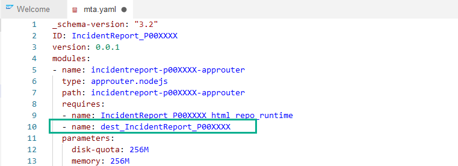

3. Scroll down until the end of the document and after *line 44*, paste the code below (including dashes) and then save changes by going to **File > Save All** 

``` 
  - name: destination_incident_report
  type: org.cloudfoundry.managed-service
  parameters:
    service: destination
    service-plan: lite
```
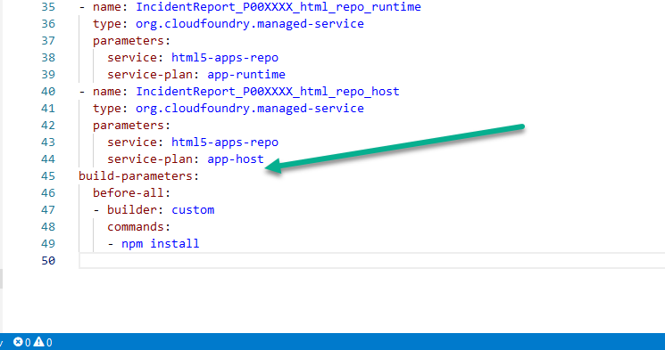

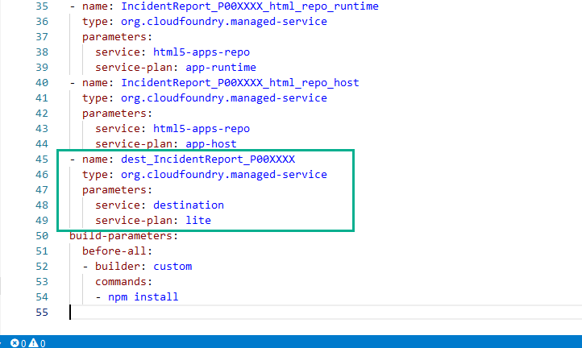

4. Open the **Run Configurations** view and click **+** and select **IncidentReport**.

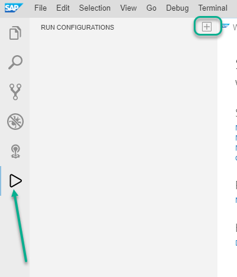

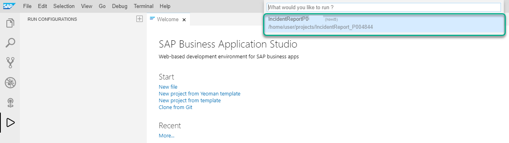
 
 5. Select **index.html** and **latest**
  

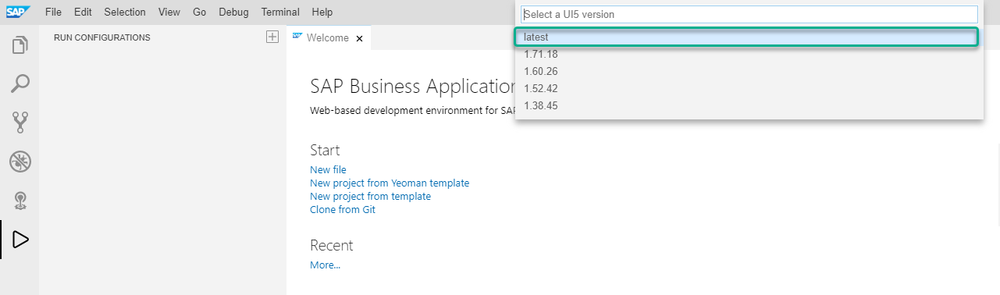
 
 6. If you are asked to enter a name, leave the default value and press **Enter**.
 
 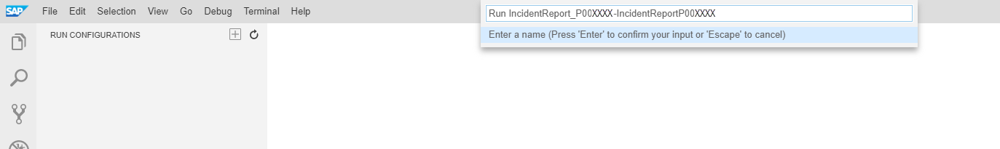
 
 7. Expand the run configuration to display the services that can be bound.
  
 
 
 > SAP Business Application Studio allows you to test your app with resources.

 8. To bind to the destination service, Hover over Data Source (Destination) and click the bind icon to the right of the Destination Service.
 
 In the destinations list, type *master* and choose the *master_x_incidentservice* where x should be replaced by your platform user group (a, b, c or d).
 
 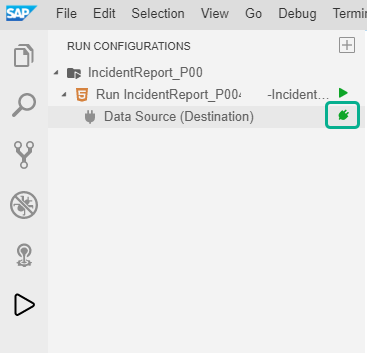
 
 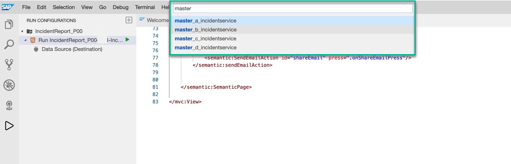
 
> Once the destination service has been bound, the Bind icon turns green.

> To unbind the destination service, click the Unbind icon.


9. Hover over the run configuration and click the Run Module icon.

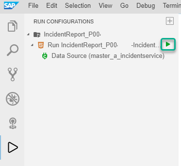

10. Wait for the notification saying _"A service is listening to port **6004**"_. Click the notification button.

> The left side panel changes to the debug pane and the status bar color changes to orange to indicate that the app is running in debug mode.

> If you are running the app for the first time, the button in the notification will say Expose and Open. Otherwise it will say Open in New Tab.

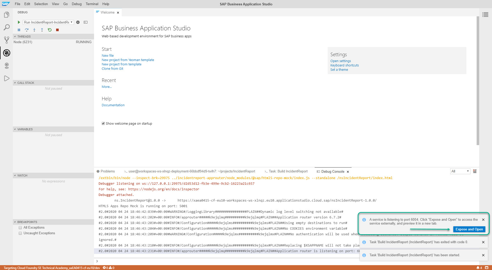

> You may optionally add a port description.


The app will open in a new tab and a list of incidents is displayed.

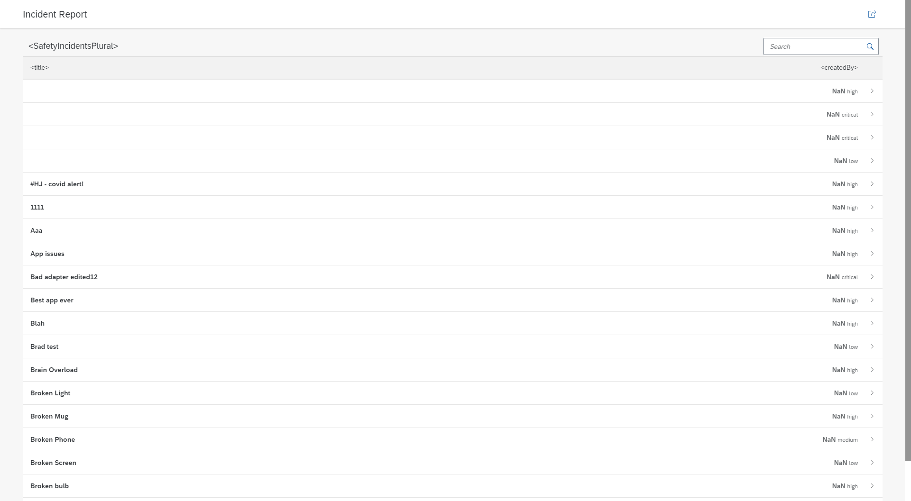


Congratulations!. You have successfully completed part 1.

[Next Exercise](Part%202%20-%20Modify%20UI5%20App.md)
