# Modify your SAPUI5 Application

You are now able to visualize a list of incidents and its details. In this section you will learn how to modify the application interface to make it more user-friendly as well as adding other funtionality to create new incidents.

## Step 1: Copy new files

1. In Explorer, go to **IncidentReportIXXXXXX > webapp > view**, right click on  **view** folder and select **Upload Files...**


2. From the docouments you downloaded, open **view** folder, select all the files and click **Open**.

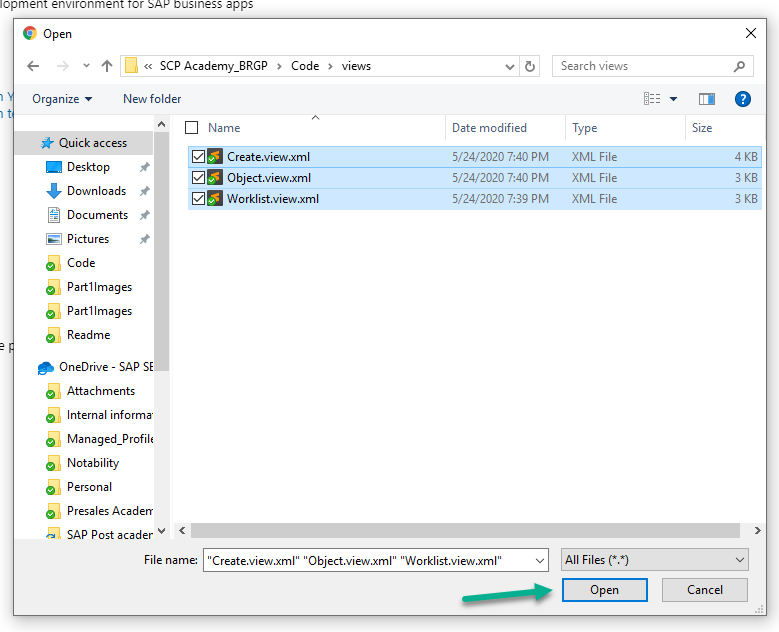

3. We will repeat the previous two steps for **controller**, **model** and **i18n** folders. Right click on them, select **Upload Files...** and shose the files inside the corresponding folder from the documents downloaded previously.

Once this is done, explorer view should look like this:

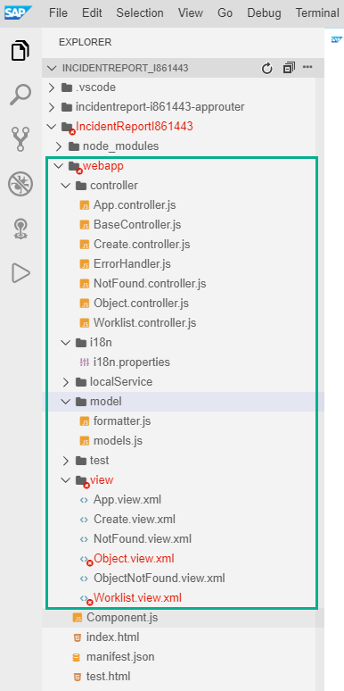

## Step 2: Change user ID in view files.

We just copied a few teamplates which have generic user, we will now change to reflect you I user.

1. Go to **IncidentReportIXXXXXX > webapp > view**, right click on **Worklist.view.xml** and select **Open With > Code Editor** 

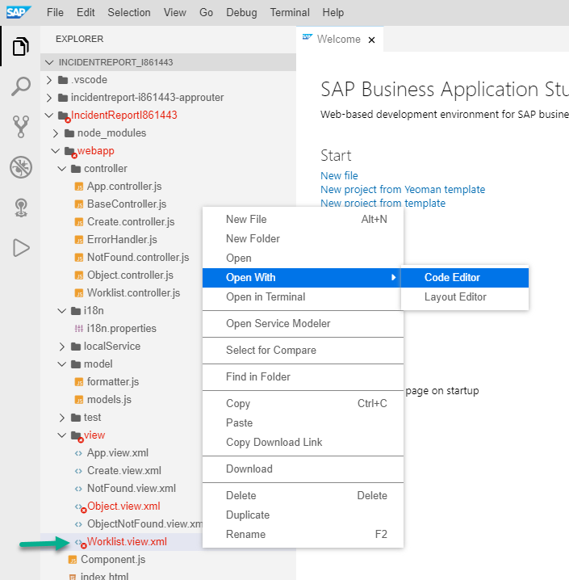

2. *On line 2* replace IXXXXXX with your I number.

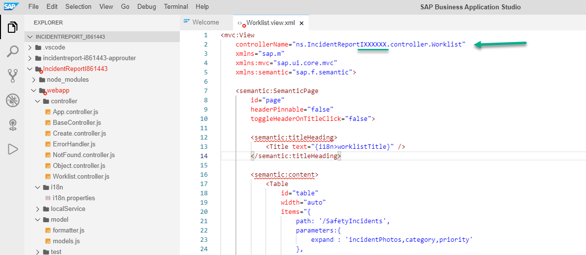

3. Repeat the previous two steps for files **Object.view.xml** and **Create.view.xml**

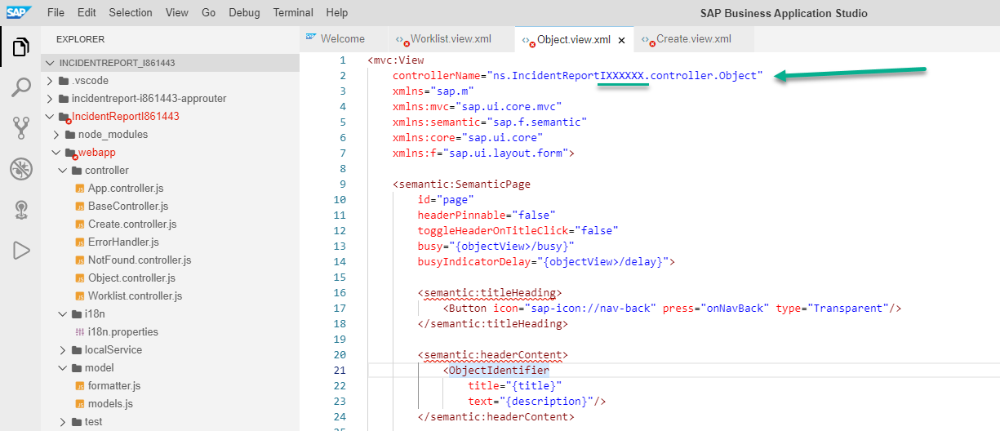

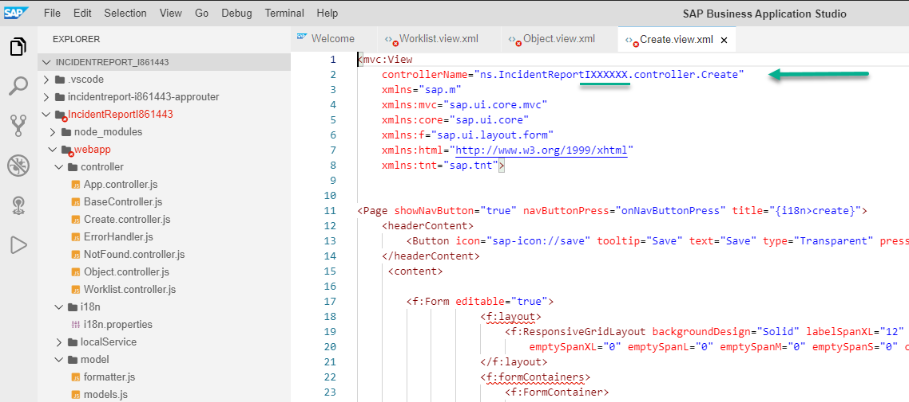

## Step 3: Change user ID in js files.

1. Go to **IncidentReportIXXXXXX > webapp > controller** and open **Create.controller.js** file.

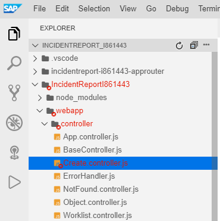

2. *On line 19* replace IXXXXXX with your I number.

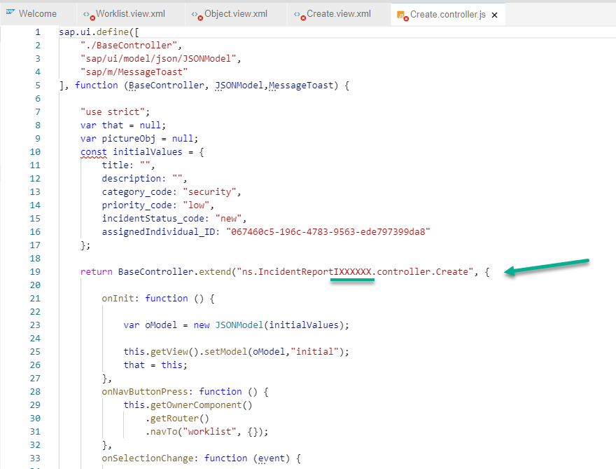

3. Scroll down and do the same *on lines 117, 168 and 203*

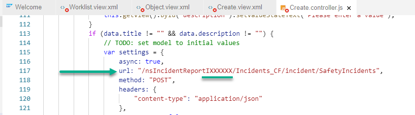

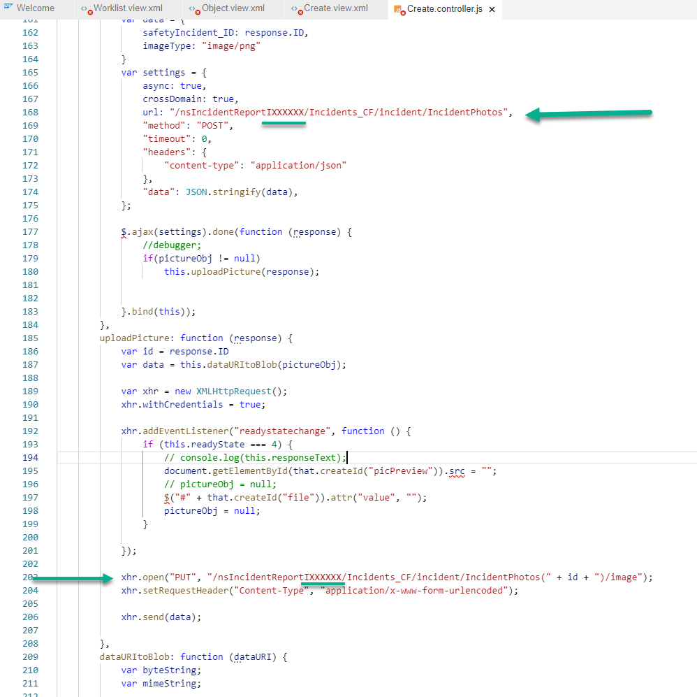

4. Finally, go to **IncidentReportIXXXXXX > webapp > model** and open **formatter.js** file.

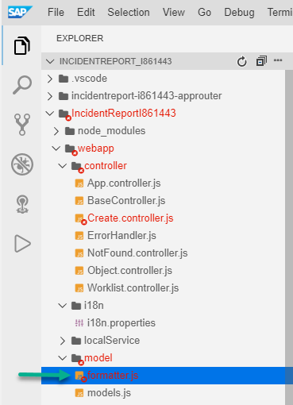

5. *On line 14*, replace IXXXXXX with your I number.

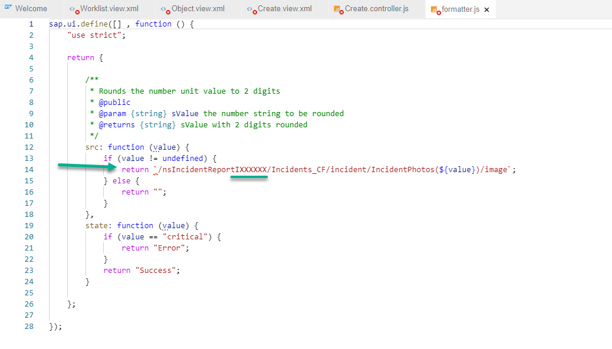

> Note: Don't forget to save your changes. Go to **File > Save All**.

## Step 4: Add application header and create button

In this section, we will add a fixed header to the entire application within which we will include an _add_ button that will open our _Create_ view.

1. We will use _App view_ which is the main application container. Right click on **App.view.xml > Open With > Code Editor** 

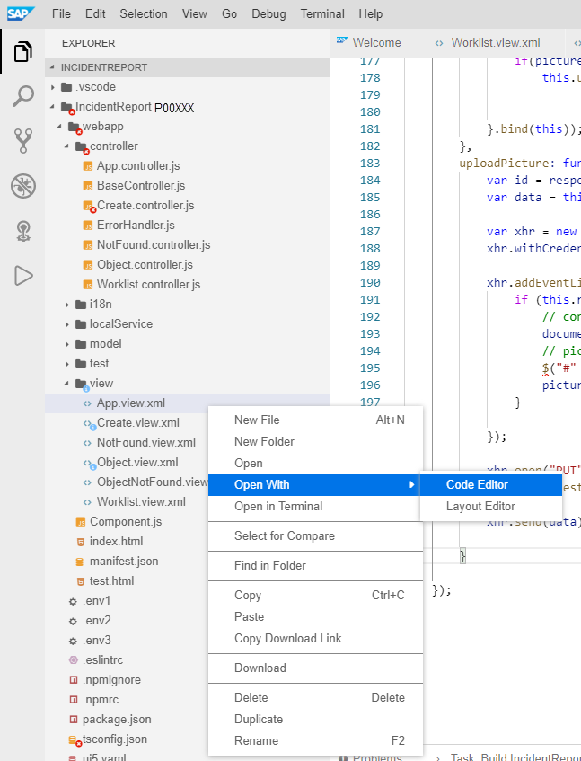

2. In _App view_, we will add a header but first we need to add an additional library right after *xmlns:mvc="sap.ui.core.mvc"*

```xml
	xmlns:tnt="sap.tnt"
```
Above ```<App id="app"/>``` paste the code below.

```xml
	<tnt:ToolHeader id="nav">
		<Image src="https://www.sap.com/dam/application/shared/logos/sap-logo-svg.svg.adapt.svg/1493030643828.svg" width="50px"></Image>
		<Text text="{i18n>appDescription}" wrapping="false"/>
		<ToolbarSpacer/>
		<Button type="Transparent" icon="sap-icon://add" press="toCreate"></Button>
	</tnt:ToolHeader>
```
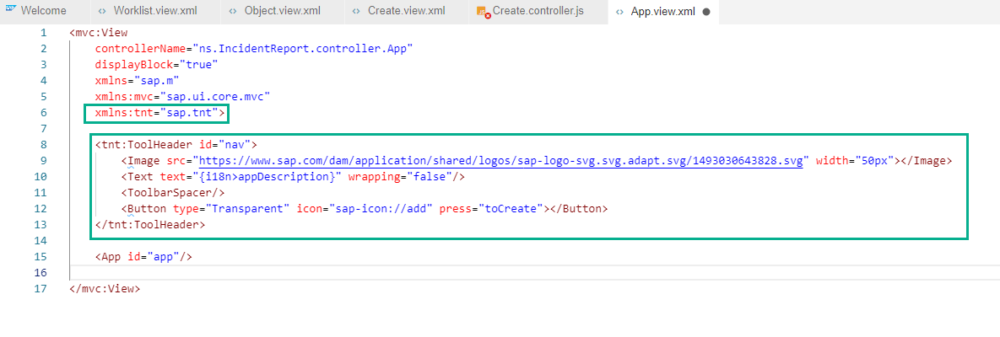

3. Open **App.controller.js**

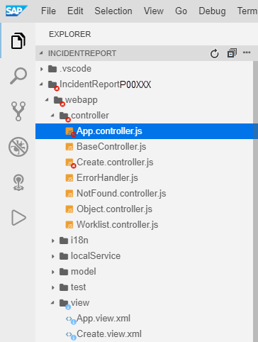

4. Please add the code below, after _onInit_ function (**don't forget to include the comma at the beginning**):

```javascript
	,
        toCreate: function () {
			// apply content density mode to root view
			this.getOwnerComponent()
				.getRouter()
				.navTo("RouteCreate", {});
        }
```
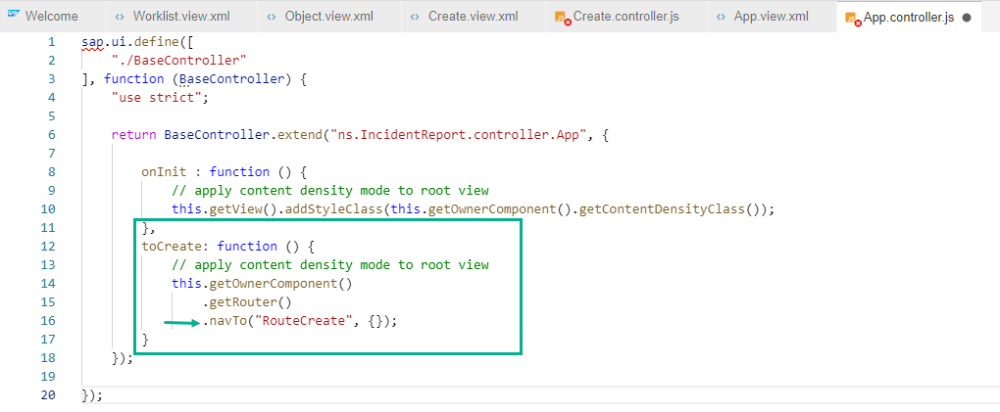

> Note: Don't forget to save your changes. Go to **File > Save All**.

## Step 5: Add route and target

In this section, we will define a route that will tell our application how to navigate from one view to another.

1. Go to **IncidentReportIXXXXXX > webapp**  and open **manifest.json** file.

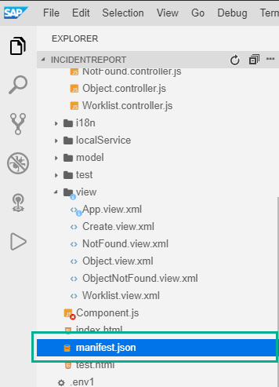

2. Scroll down until _routes_ section and right after the last bracket (line 110), add a new route (**don't forget to include the comma at the beginning**)

```javascript	
	,
        {
			"name": "RouteCreate",
			"pattern": "create",
			"target": [
				"create"
			]
	}
```
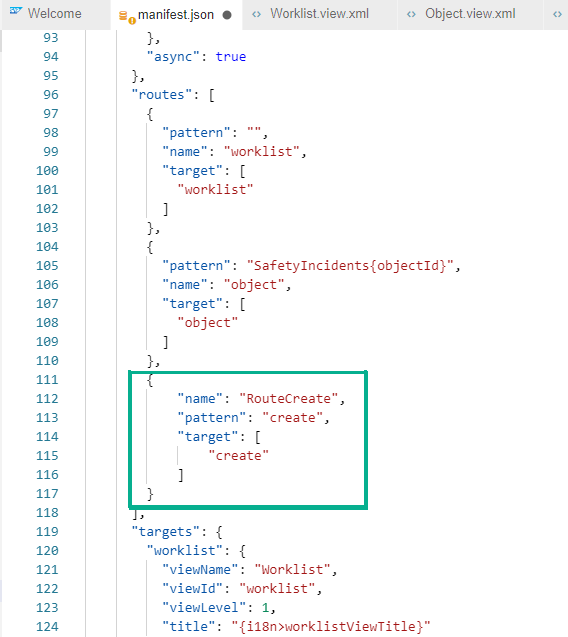

3. Scroll further down until you see targets and *on line 139* add a new target (**don't forget to include the comma at the beginning**)

```javascript
	,
        "create": {
          "viewName": "Create",
          "viewId": "create"
        }
```
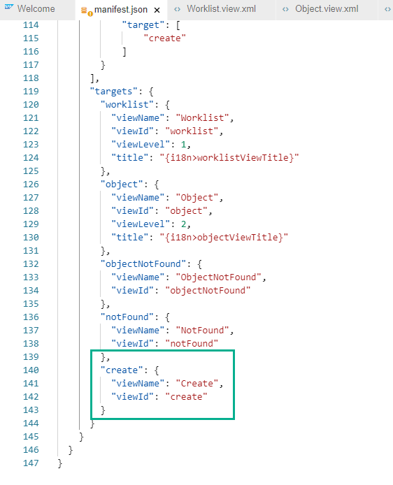

4. After creating a new incident, we want our worklist to be refreshed automatically, therefore we will add a refresh instruction after the main view is called again.

Go back to **Worklist.controller.js**.

Inside _onInit_ function, please add:

```javascript
	this.getOwnerComponent().getRouter().getRoute("worklist").attachPatternMatched(this._onObjectMatched, this);
```
After _onInit_ funtion, please add:

```javascript
	_onObjectMatched : function (oEvent) {
                //debugger;
                this.getView().byId("table").getBinding("items").refresh();
        },
```
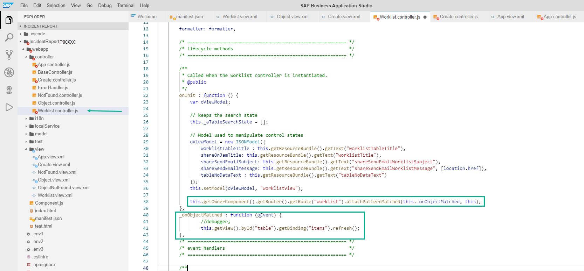

> Note: Don't forget to save your changes. Go to **File > Save All**.

Congratulations!. You have successfully completed part 2.

[Next Exercise](Part%203%20-%20Add%20a%20chatbot%20to%20your%20SAPUI5%20app.md)
