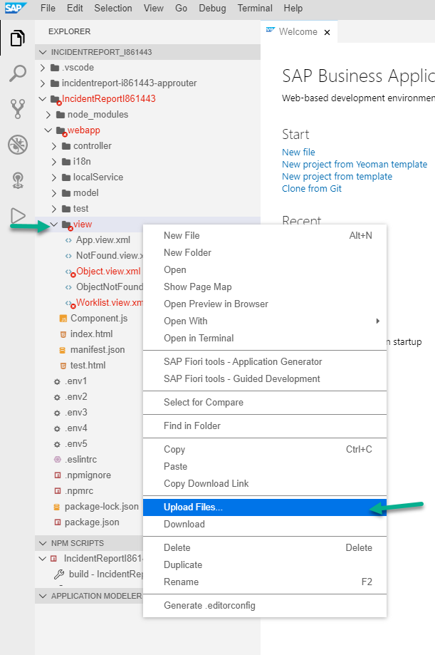

# Modify your SAPUI5 Application

You are now able to visualize a list of incidents and its details. In this section you will learn how to modify the application interface to make it more user-friendly as well as adding other funtionality to create new incidents.

## Step 1: Copy new files

1. In Explorer, go to **IncidentReportIXXXXXX > webapp > view**, right click on  **view** folder and select **Upload Files...**



2. From the docouments you downloaded, open **view** folder, select all the files and click **Open**.


3. We will repeat the previous two steps for **controller**, **model** and **i18n** folders. Right click on them, select **Upload Files...** and shose the files inside the corresponding folder from the documents downloaded previously.

Once this is done, explorer view should look like this:


## Step 2: Change user ID in new files.

We just copied a few teamplates which have generic user, we will now change to reflect you I user.

1. Go to **


2. Right-click on the new file and select **Open With > Code Editor** and add the code below.

> Note: In the second line, replace *P00XXXX* with your P user.

```xml
	<mvc:View
		controllerName="ns.IncidentReportP00XXXX.controller.Create"
		xmlns="sap.m"
		xmlns:mvc="sap.ui.core.mvc"
		xmlns:core="sap.ui.core" 
		xmlns:f="sap.ui.layout.form"
		xmlns:html="http://www.w3.org/1999/xhtml"
		xmlns:tnt="sap.tnt">
```


On *line 2*, we specify the controller name which is a will handle the interaction with our view, *lines 3 to 8* are libraries that allow adding specific components to the view, for instance **sap.ui.layaout.form** allows us to add form components which will be used for this exercise

3. Copy and paste the code below which will add some components to the header section of the view.

```xml
	<Page showNavButton="true" navButtonPress="onNavButtonPress" title="{i18n>create}">
	<headerContent>
		<Button icon="sap-icon://save" tooltip="Save" text="Save" type="Transparent" press="onSave"/>
	</headerContent>
```


*Line 11* opens the Page tag which is the main container of our view, we set the navigation back button as enable and define a handler that we will define afterwards. 

*Lines 12 to 14* are adding a button to the view's header, this will help us to save the new incident. Similarly, we are defining a press event to the navigation button, and its corresponding function to handle it. We will discuss it in more detail later on.

4. Let's now add the content to our view.

```xml
		<content>
			<f:Form editable="true">
				    <f:layout>
					<f:ResponsiveGridLayout backgroundDesign="Solid" labelSpanXL="12" labelSpanL="12" labelSpanM="12" labelSpanS="12" adjustLabelSpan="false"
					    emptySpanXL="0" emptySpanL="0" emptySpanM="0" emptySpanS="0" columnsXL="1" columnsL="1" columnsM="1" singleContainerFullSize="true"/>
				    </f:layout>
				    <f:formContainers>
					<f:FormContainer>
					    <f:formElements>
						<f:FormElement label="Title">
						    <f:fields>
							<Input id="title" value="{initial>/title}" required="true" liveChange="onInput"/>
						    </f:fields>
						</f:FormElement>
						<f:FormElement label="Description">
						    <f:fields>
							<Input id="description" value="{initial>/description}" required="true" liveChange="onInput"/>
						    </f:fields>
						</f:FormElement>
						<f:FormElement label="Category">
						    <f:fields>
							<ComboBox id="category" items="{/Category}" change="onSelectionChange" selectedKey="{initial>/category_code}">
							    <core:Item key="{code}" text="{name}"/>
							</ComboBox>
						    </f:fields>
						</f:FormElement>
						<f:FormElement label="Priority">
						    <f:fields>
							<ComboBox id="priority" items="{/Priority}" change="onSelectionChange" selectedKey="{initial>/priority_code}">
							    <core:Item key="{code}" text="{name}"/>
							</ComboBox>
						    </f:fields>
						</f:FormElement>
						<f:FormElement label="Attachment">
						    <f:fields>
							<Button icon="sap-icon://camera" press="onTakePicture"></Button>
							<html:input id="file" type="file" accept="image/*" capture="camera" style="visibility: hidden"/>
							<Image  width="200px" id="picPreview"></Image>
						    </f:fields>
						</f:FormElement>
					    </f:formElements>
					</f:FormContainer>
				    </f:formContainers>
				</f:Form>
			</content>
		</Page>
	</mvc:View>
```


*Line 15* opens a content tag where we will add the content of our view. *Lines 17 to 21* describe the type of object we will include in the view, for our scenario it will be a *simple form* with some input controls.

*Lines 22 to 58* includes the different fields of our form. For open text such as title or description we will use an *Input* control. In case of fixed values, we are using a *Combo Box*. Pay attention to *line 37*, we are binding the item to a oData object *Category*, this will ensure the items we select are identical to the ones in our oData service.

_Save your changes by clicking **File > Save All**_

## Step 3: Create a new controller

After we created our view, we will require a new controller to handle every user interaction.

1. Right click on **controller > New File** and name it **Create.controller.js**


2. Open the new file and add the code below

> Note: In the **return BaseController** sentence, replace *P00XXXX* with your P user.

```javascript
	sap.ui.define([
		"./BaseController",
		"sap/ui/model/json/JSONModel",
		"sap/m/MessageToast"
	], function (BaseController, JSONModel,MessageToast) {
	
		return BaseController.extend("ns.IncidentReportP00XXXX.controller.Create", {
		
		});
	});
	
```


This is the initial code for our controller. It includes some libraries *(lines 2 to 4)* and it describes the controller's name *(line 7)*

3. Right above the return sentence, we will add some global variables. They will define the initial information when a new incident is created.

Please, add the code below:

```javascript
	"use strict";
	var that = null;
	var pictureObj = null;
	const initialValues = {
		title: "",
		description: "",
		category_code: "security",
		priority_code: "low",
		incidentStatus_code: "new",
		assignedIndividual_ID: "067460c5-196c-4783-9563-ede797399da8"
	};
```


4. Within *return* clause, we will add all the functions to describe the view funtionality. The first function is called *onInit*, this is the first function to be executed when the view is loaded.

Please, add the code below:

```javascript
	onInit: function () {
		
		var oModel = new JSONModel(initialValues);
		
		this.getView().setModel(oModel,"initial");
		that = this;
		
		},
```


*Lines 22 to 24* create a new model with the data from our global variables and then it assigns the model to the view, we also name it *initial* to refer to it. *Line 25* is only a reference to the view, we will use it later on.

5. We will start adding event handlers. Our first event will occur when users click on *Navigation* button, the only action we want to happen is to go back to our main view.

Please, add the code below:

```javascript
	onNavButtonPress: function () {
		this.getOwnerComponent()
		    .getRouter()
		    .navTo("worklist", {});
        },
```


*On line 28* we define the funtion and on *lines 29 to 31* we navigate to a *route* called worklist. This route was created by the wizard, we will discuss more about it later in this tutorial.

6. We want to ensure we don't get errors when saving new incidents. In order to ensure that, we will add a few functions to validate the data entered by users.

Please, add the code below:

```javascript
	onSelectionChange: function (event) {
            
			var data = that.getView().getModel("initial").getData();
			if (
				event
				.getSource()
				.getId()
				.indexOf("category") > 0
			) {
				data.category_code = event.getSource().getProperty("selectedKey");
			} else {
				data.priority_code = event.getSource().getProperty("selectedKey");
			}
			that
				.getView()
				.getModel("initial")
				.setData(data);
		}.bind(this),
		onInput: function (event) {
			var data = event.getSource().getValue();
			if (event.getSource().getId().indexOf("title") > 0) {
				if (data.length > 0) {
					this.getView().byId("title").setValueState("None");
					this.getView().byId("title").setValueStateText("");
				} else {
					this.getView().byId("title").setValueState("Error");
					this.getView().byId("title").setValueStateText("Please enter a value");
				}
			}
			if (event.getSource().getId().indexOf("description") > 0) {
				if (data.length > 0) {
					this.getView().byId("description").setValueState("None");
					this.getView().byId("description").setValueStateText("");
				} else {
					this.getView().byId("description").setValueState("Error");
					this.getView().byId("description").setValueStateText("Please enter a value");
				}
			}
        },
```


On *lines 33 to 50* we added a function that will be triggered when the value of any combo box changes and we will store the new value in the corresponding global variable *(lines 42 and 44)*

On *lines 51 to 71* is a function that will be triggered when the value of any input field changes. If data length is equal to zero, we will show an error message because we cannot have empty values.

7. We will add a new function to trigger the picture uploading when the *upload* buton is clicked

Please, add the code below:

```javascript
	onTakePicture: function () {
			//trigger click event for the input field to open camera
			var image = document.getElementById(this.createId("file"));
			image.click();
		},
```


8. After a file is selected, we want to show it as a thumbnail in our view. To do so, we will add another function called *onAfterRendering* which is triggered after the view is loaded and rendered.

Please, add the code below:

```javascript
	onAfterRendering: function () {
			var oID = this.createId("picPreview");
			//handle the event when a new picture is uploaded or a new pictures was taken using the camera
			document
				.getElementById(this.createId("file"))
				.addEventListener("change", function () {

					//check if there is an image
					if (this.files && this.files[0]) {

						var previewPic = document.getElementById(oID);
						var reader = new FileReader();
						reader.onload = function (e) {
							previewPic.src = e.target.result;
							pictureObj = e.target.result
						};

						reader.readAsDataURL(this.files[0]);

					}
				});
        },
```


On *lines 80 to 82* we added a new event to the html file button. *Line 90* will update the _src_ attribute of  our image component and replace it by the new image url.

9. Before saving the record in our oData service, we will carry out a last data validation.

Please, add the code below:

```javascript
	onSave: function () {

		var data = this.getView()
			.getModel("initial")
                	.getData();
            
			if (data.title == "") {
				this.getView().byId("title").setValueState("Error");
				this.getView().byId("title").setValueStateText("Please enter a value");
			}
			if (data.description == "") {
				this.getView().byId("description").setValueState("Error");
				this.getView().byId("description").setValueStateText("Please enter a value");
			}
		},
```


On *lines 101 to 103* we extracted the values from our model, this values will be sent in the next step.  

10. Right after the if sentence, where we validated that filed *description* is not empty, we will include a asynchronous call to our oData service. We will perform a POST action to create a new record.

Please, add the code below:

> Note:  In the url, replace *P00XXXX* with your P user. and the **x** in *master_x_incidentservice* with the corresponding platform user (a, b, c or d).

```javascript
	if (data.title != "" && data.description != "") {
				// TODO: set model to initial values
				var settings = {
					async: true,
					url: "/nsIncidentReportP00XXXX/master_x_incidentservice/incident/SafetyIncidents",
					method: "POST",
					headers: {
						"content-type": "application/json"
					},
					processData: false,
					data: JSON.stringify(data)
				};
				$.ajax(settings)
					.done(
						function (response) {

							var msg = "Incident successfully created";
							MessageToast.show(msg);
							//reset the from model to initial values to empty the fields
                            this.getView().getModel("initial").setData({
								title: "",
								description: "",
								category_code: "security",
								priority_code: "low",
								incidentStatus_code: "new",
								assignedIndividual_ID: "067460c5-196c-4783-9563-ede797399da8"
							});
							// create picture instance
							this.createPicture(response);

							//update the home page request with the new value
							//this.updateReportsModel();
							//clear picture

							//nativate back to home page
							this.getOwnerComponent()
								.getRouter()
								.navTo("worklist", {});
						}.bind(this)
					)
					.fail(function () {
						MessageToast.show("Error: Please Try Again!");
					});
			}
```


On *lines 115 to 124* we define general setting such as _url, method, headers_. In the URL parameter *(line 117)* we are using our destination and pointing to _SafetyIncidents_ entity. The application will show a toast message with the result status.

In this function, we only created the _SafetyIncidents_ record but now we need to create 2 additional ajax calls to: 
	a. Create image metadata
	b. Upload image file

>	
	We are using standard ajax calls. If you want to know more, please go to: https://www.w3schools.com/jquery/ajax_ajax.asp

11. This step is very similar to the previous one. But in this case, we are changing the url to point to the right entity.

Please, add the code below:

> Note:  In the url, replace *P00XXXX* with your P user. and the **x** in *master_x_incidentservice* with the corresponding platform user (a, b, c or d).

```javascript
	createPicture: function (response) {
			var data = {
				safetyIncident_ID: response.ID,
				imageType: "image/png"
			}
			var settings = {
				async: true,
				crossDomain: true,
				url: "/nsIncidentReportP00XXXX/master_x_incidentservice/incident/IncidentPhotos",
				"method": "POST",
				"timeout": 0,
				"headers": {
					"content-type": "application/json"
				},
				"data": JSON.stringify(data),
			};

			$.ajax(settings).done(function (response) {
                //debugger;
                if(pictureObj != null)
                    this.uploadPicture(response);
                

			}.bind(this));
        },	
```


12. We will create another ajax call to upload the image

Please, add the code below:

> Note:  At the very end in the **xhr.open** url, replace *P00XXXX* with your P user. and the **x** in *master_x_incidentservice* with the corresponding platform user (a, b, c or d).

```javascript	
	uploadPicture: function (response) {
			var id = response.ID
			var data = this.dataURItoBlob(pictureObj);

			var xhr = new XMLHttpRequest();
			xhr.withCredentials = true;

			xhr.addEventListener("readystatechange", function () {
				if (this.readyState === 4) {
					// console.log(this.responseText);
					document.getElementById(that.createId("picPreview")).src = "";
					// pictureObj = null;
					$("#" + that.createId("file")).attr("value", "");
					pictureObj = null;
				}

			});

			xhr.open("PUT", "/nsIncidentReportP00XXXX/master_x_incidentservice/incident/IncidentPhotos(" + id + ")/image");
			xhr.setRequestHeader("Content-Type", "application/x-www-form-urlencoded");

			xhr.send(data);

        },
```


In order to upload the picture, we first need to pre process it. This is done by calling function _dataURItoBlob_ on *line 185*.

13. We will create function _dataURItoBlob_ which will convert the image into a Blob object.

Please add the code below and save your changes:

_Save your changes by clicking **File > Save All**_

```javascript
	dataURItoBlob: function (dataURI) {
			var byteString;
			var mimeString;

			// separate the mimetype and byte string
			if (dataURI.split(',')[0].indexOf('base64') >= 0)
				byteString = atob(dataURI.split(',')[1]);
			else
				byteString = unescape(dataURI.split(',')[1]);

			// separate out the mime component
			mimeString = dataURI.split(',')[0].split(':')[1].split(';')[0];

			// write the bytes of the string to a typed array
			var ia = new Uint8Array(byteString.length);
			for (var i = 0; i < byteString.length; i++) {
				ia[i] = byteString.charCodeAt(i);
			}

			return new Blob([ia], {
				type: mimeString
			});
        }
```


## Step 4: Add application header and create button

In this section, we will add a fixed header to the entire application within which we will include an _add_ button that will open our _Create_ view.

1. We will use _App view_ which is the main application container. Right click on **App.view.xml > Open With > Code Editor** 


2. In _App view_, we will add a header but first we need to add an additional library right after *xmlns:mvc="sap.ui.core.mvc"*

```xml
	xmlns:tnt="sap.tnt"
```
Above _<App id="app"/>_ paste the code below.

```xml
	<tnt:ToolHeader id="nav">
		<Image src="https://www.sap.com/dam/application/shared/logos/sap-logo-svg.svg.adapt.svg/1493030643828.svg" width="50px"></Image>
		<Text text="{i18n>appDescription}" wrapping="false"/>
		<ToolbarSpacer/>
		<Button type="Transparent" icon="sap-icon://add" press="toCreate"></Button>
	</tnt:ToolHeader>
```


On *line 9* we added an logo to our header, please feel free to use your company logo. 

*Line 12* added a button that will trigger the navigation to the _Create view_

3. Open **App.controller.js**


4. Please add the code below, after _onInit_ function (don't forget to include the comma at the beginning):

```javascript
	,
        toCreate: function () {
			// apply content density mode to root view
			this.getOwnerComponent()
				.getRouter()
				.navTo("RouteCreate", {});
        }
```


On *lines 14 to 16* we navigate to a route called _RouteCreate_. This route does not exist yet, we will add it in the next step.

## Step 5: Add route and target

In this section, we will define a route that will tell our application how to navigate from one view to another.

1. Open the **manifest.json**


2. Scroll down until _routes_ section and right after the last bracket (line 111), add a new route (don't forget to include the comma at the beginning)

```javascript	,
        {
			"name": "RouteCreate",
			"pattern": "create",
			"target": [
				"create"
			]
	}
```


This route indicates the app must jump to a target called _create (line 115)_

3. Scroll further down until you see targets and add a new target (don't forget to include the comma at the beginning)

```javascript
	,
        "create": {
          "viewName": "Create",
          "viewId": "create"
        }
```


4. After creating a new incident, we want our worklist to be refreshed automatically, therefore we will add a refresh instruction after the main view is called again.

Go back to **Worklist.controller.js**.

Inside _onInit_ function, please add:

```javascript
	this.getOwnerComponent().getRouter().getRoute("worklist").attachPatternMatched(this._onObjectMatched, this);
```
After _onInit_ funtion, please add:

```javascript
	_onObjectMatched : function (oEvent) {
                //debugger;
                this.getView().byId("table").getBinding("items").refresh();
        },
```


On *line 38* we attached a new event that will be triggered when the view is called from another view. *Line 42* will refresh the table content to show the most recent incident created.

5. Refresh the application preview to see your changes.


Congratulations!. You have successfully completed part 2.

[Next Exercise](Part%203%20-%20Add%20a%20chatbot%20to%20your%20SAPUI5%20app.md)
