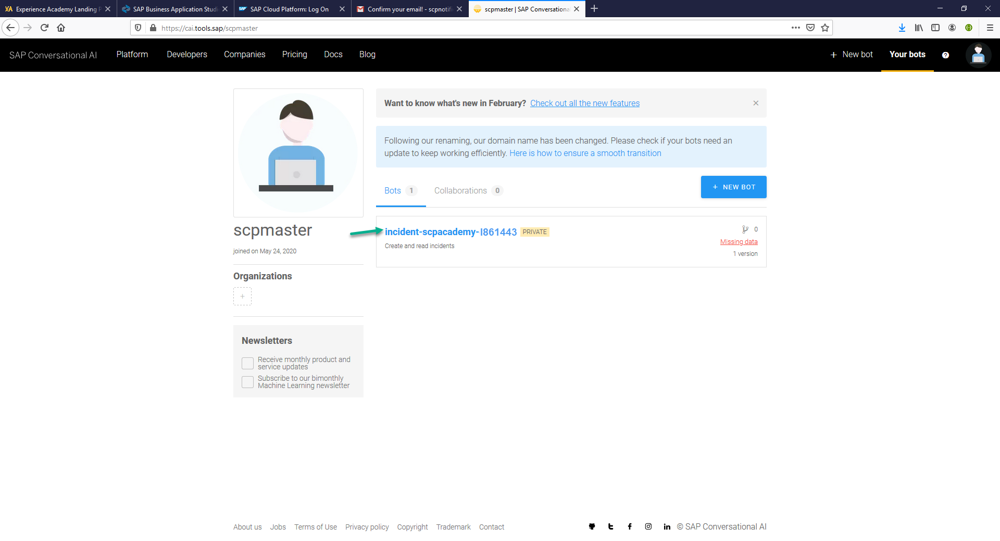
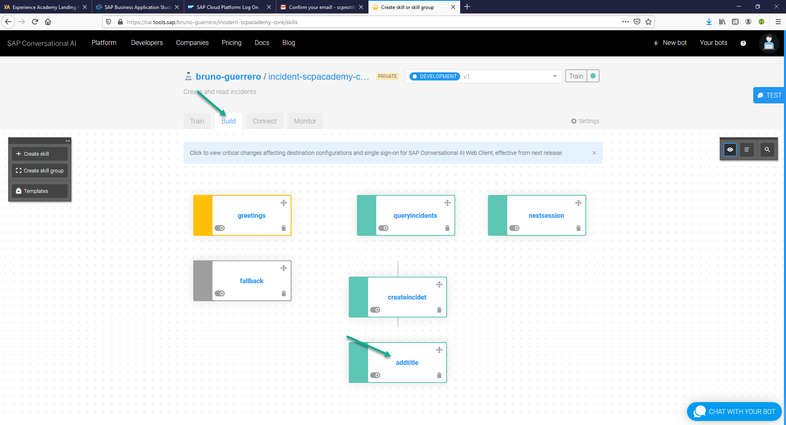

# Add a chatbot to your SAPUI5 Application

If you deploy your application right now, you would be able to visualize and create indicents in a SAPUI5 application, but that's boring. By adding a chatbot to your app, you will enable a new channel to interact with your business applications.

In this section, we will create a chatbot by leveraging SAP Conversational AI and embed it into your SAPUI5 application.

## Step 1: Create a SAP Conversational AI account

We will first create a SAP Conversational AI account. If you already have one, please skip this step.

1. Access to https://cai.tools.sap/ and click on **SIGN UP**


2. Fill out the form with your corporate *Email, an unique Username and Password* anc click on **CONTINUE TO SIGN UP** and then click on **ACCEPT AND REGISTER** at the bottom of your screen


3. You will receive a verification email, click **Click to validate your email**.


4. Log in to SAP Conversational AI by clicking **Log in** at the upper right-hand corder of your screen.


## Step 2: Modify chatbot project

We have created a chatbot template you can reuse. 

1. Once you created you account, please share your user ID with your instructor so he can share the project with you.

> Note: You can find the user ID right below the user picture.


2. Once the project has been shared with you, enter by clicking the project name.



3. Go to **Build** tab and click on skill **addtitle*.



4. Go to **Actions** tab and scroll all the way down.


5. Go to the third API Service Configuration (the one with URL **https://api.workflow-sap.cfapps.sap.hana.ondemand.com/workflow-service/rest/v1/workflow-instances**).


6. Go to Authentication, and enter the values below, then click **SAVE** 

 
* CLIENT ID : sb-clone-65c79e41-dc55-44b4-b788-625fe83d0eb0!b12781|workflow!b2746

* CLIENT SECRET : 6bcb9547-6230-4bb5-a404-2d66e2d706b3$Fyc4rbjFlU1BgiZ72WdyKUQ7t1jspW8ZjKTKN105YlE=


7. Go to **Body** and, for *definitionId* and *userID*, change *I861443* with your I number AND **SAVE**


## Step 3: Integrate your chatbot with your SAPUI5 application
 
 1. We need first to create a new **User Channel**. In your SAP CAI main screen, please go to **Connect > Users channels** and click the **+** button on the right-hand side of **Webchat** channel.
 
 
 
 2. Please customize you new channel. You can choose a color, a logo and  an initial onboarding message.
 
 > SAP Logo: https://corra.com/wp-content/uploads/Sap-Logo--1024x1024.png
 
 
 
 
 
 
 
 
 
 3. In step 5 **Global settings** please make sure you select **Not saved** UNDER **Conversation saved for**, this will delete you conversation every time you refresh your screen.
 
 After you are done, please click **CREATE**
 
 > Note: You can name your channel as you wish
 
 
 
 4. Please write down the *channelId* and *token* and click **SAVE CHANGES**
 
 
 
 5. Go back to Business Application Studio and open **IncidentReportIXXXXXX > webapp > Component.js** file.
 
 
 
 6. Inside **Component.js** file, add the following code (**Please replace YOUR CHANNEL ID and YOUR TOKEN for the corresponding values gotten in point number 4**):
 
 After *this.getRouter().initializa();*
 
```javascript 
	//Initialize chatbot view
  	this.renderRecastChatbot();
``` 
 Right after the closing Brace of init function *},*:
 
```javascript 
	renderRecastChatbot: function () {
			if (!document.getElementById("cai-webchat")) {
				var s = document.createElement("script");
				s.setAttribute("id", "cai-webchat");
				s.setAttribute("src", "https://cdn.cai.tools.sap/webchat/webchat.js");
				document.body.appendChild(s);
			}
			s.setAttribute("channelId", "YOUR CHANNEL ID");
			s.setAttribute("token", "YOUR TOKEN");
		},
```


> Note: Don't forget to save your changes by clicking **File > Save All**

## Step 4: Deploy your application

1. In your project workspace, expand **IncidentReportIXXXXXX** and right-click on **xs-app.json > Copy**


2. Go to **IncidentReportIXXXXXX > webapp** and paste the *xs-app.json* by using *Ctrl + v*


3. Click to **Terminal > New Terminal**.

A new Terminal will be open at the bottom of your screen.


4. Enter the command below and press enter.

>	mbt build -p=cf

The build process creates a multi target archive (MTAR) file in your project that packages all the project modules for deployment. You can find the MTAR file in the */mta_archive*.


5. Right click on the mtar file and click **Deploy MTA Archive**


6. The deployment process takes a few minutes. You can see that the deployment is still in progress in the Task: Deploy console at the bottom right of your screen.

When the deployment process is complete, you will se the app URL in the console. Copy and paste in a new browser tab and append **/nsIncidentReportIXXXXXX/index.html** (**don't forget to replace IXXXXXX with your P user**)


Congratulations! You have successfully completed part 3.

[Next Exercise](Part%204%20-%20Deploy%20a%20SCP%20Workflow.md)
