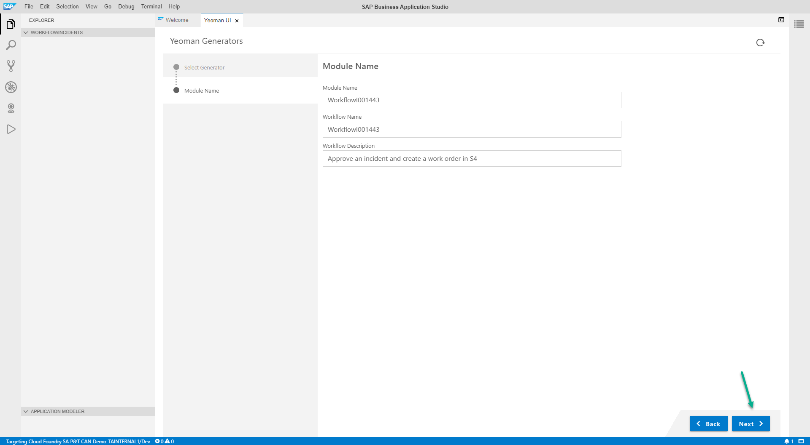

# Deploy a SCP Workflow to approve new incident

When a new incident is created and a workflow will be triggered which will connect to SuccessFactors to extract the employee's information. After the workflow is approved, a new Work order will be created in S/4HANA.

## Step 1: Create a SAP Workflow Project

1. Go back to Business Application Studio and go to **File > Open Workspace...** and select **projects**.

2. In the explorer section, right click anywhere in the blank space and click **New Folder** and name it **WorkflowIncidents**

3. Once again, go to **File > Open Workspace...** and select **WorkflowIncidents**.

4. Go to **View > Find Command...**, type **ye** and click on **Yeoman UI Generators**.

5. Select **Workflow Module** and then click **Next**.

6. In the **Module Name** screen, input the values below (**Don't forget to replace IXXXXXX with your I number**) and then click **Next**

Parameter | Value
------------ | ------------- 
 Module Name | **WorkflowIXXXXXX**
 Workflow Name | **WorkflowIXXXXXX**
 Workflow Description | **Approve an incident and create a work order in S/4HANA**

## Step 2: Import workflow files

1. Once the project is created, go to **WorkflowIXXXXXX > workflows**, right click on **WorkflowIXXXXXX.workflow > Delete**.

2. Right click on **forms** folder then click **Upload Files...**.

3. From the documents you downloaded, go to **Workflow > forms** and select all documents inside the folder and click **Open**.

4. You will repeat steps *2* and *3* for folders: **sample-data**, **scripts** and **workflows**

After you do so, your explorer view should look like this:

5. Go to **WorkflowIXXXXXX > workflows** and right click on **WorkflowIXXXXXX.workflow** and then **Rename**, replace **IXXXXXX** with you I number.

6. Right click on **WorkflowIXXXXXX.workflow** and go to **Open With > Code Editor**

7. *On line 5, 6, 7*, replace **IXXXXXX** with you I number.

## Step 3 - Build and deploy workflow

1. Go to **Terminal > New Terminal**

2. In the terminal, enter the code below and press **Enter**.

>	mbt build -p=cf

3. Once the building process finishes, go to **mta_archives**, right click on **mta_0.0.1.mtar** and click **Deploy MTA Archive**. The process will take a few seconds.

4. Go to https://sa-p-t-can-demo-tainternal1-dev-bpmservicesflp-approuter.cfapps.sap.hana.ondemand.com/cp.portal/site#Shell-home, if you are asked to log in, please use your **SAP email and SAP password**. Then click on **Monitor Workflows**.

***You should see your workflow listed there.***

## Step 4 - Test your application

In order to test the exercise, open the application you deployed in part 3 and create a new incident using the chatbot.

