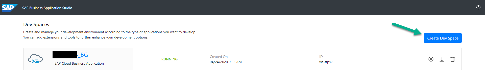
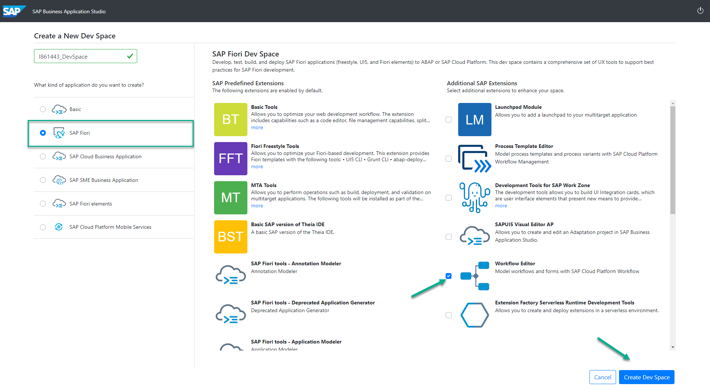
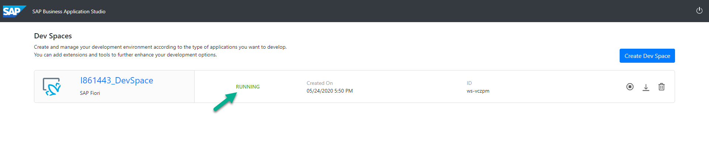

# README
In this section, we will create an UI5 application that will be consuming the back-end services created in week 1. 

## Step 1 - Access Business Application Studio

1. Open a New Browser Tab and use the following Link:

https://tainternal1.cry10cf.int.applicationstudio.cloud.sap/index.html

2. You should be prompted with a screen like this one where you will now create a Dev Space by clicking the "Create Dev Space" Button.

3. From here, you will select the **SAP Fiori Template**, check the **Workflow Editor** checkbox and provide a name for your Dev Space. We would suggest you make this name unique by including your Employee number in the name and append DevSpace. 

After you specify the name, click the button "Create Dev Space"

4. After 1-2 minutes, you should see the status of your creation change from started to running which means your Dev Space is now ready.

Once the Dev Space, says RUNNING, you will see that the Dev Space Name becomes clickable (far left of screen next to the cloud symbol). Click on the name to open it and proceed to use Business Application Studio. If you are ready to continue, click here to jump to the next exercise:

[Next Exercise](Part%201%20-%20Create%20Worklist%20Application.md)
